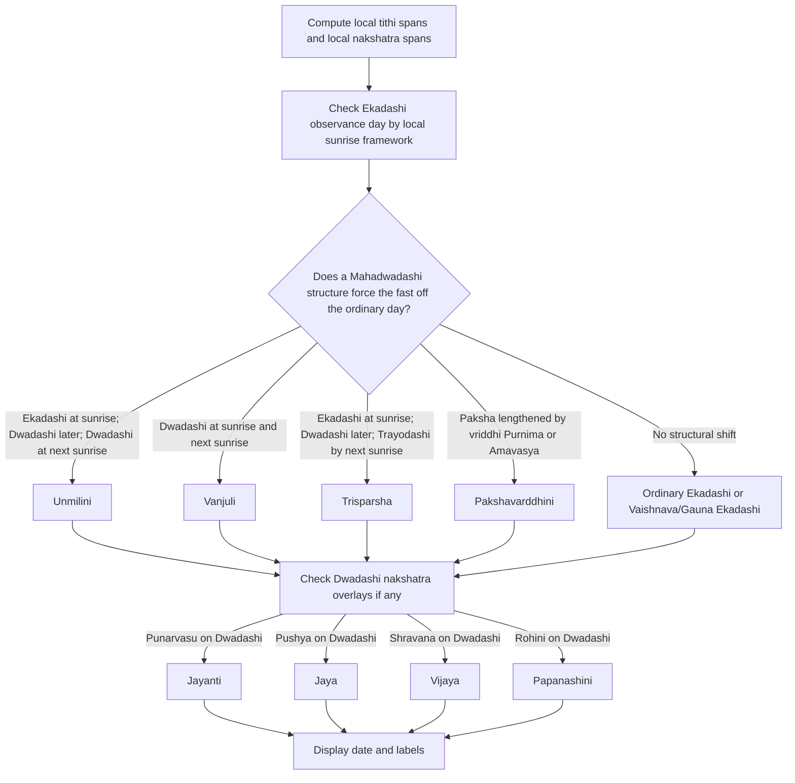

# Mahadwadashi in English Shastric Sources and DrikPanchang

## Executive summary

The eight named Mahadwadashis fall into two different logical families. Four are **structural tithi cases** driven by how Ekadashi and Dwadashi relate to **arunodaya, sunrise, sunset, and the next sunrise**: **Unmilini, Vanjuli, Trisparsha, and Pakshavarddhini**. Four are **Dwadashi-plus-nakshatra cases**: **Jayanti, Jaya, Vijaya, and Papanashini**, which DrikPanchang defines through Dwadashi’s coincidence with **Punarvasu, Pushya, Shravana, and Rohini** respectively, though not every indexed Drik snippet exposes the same strict time window for every star-condition. In the indexed materials available for this report, **midnight did not appear as a decisive checkpoint** for any of the eight; the decisive checkpoints were sunrise, arunodaya, the next sunrise, and for some Drik definitions the sunrise-to-sunset span. citeturn27search2turn27search5turn39view0

DrikPanchang’s exact English spellings differ from several common transliterations. It uses **Unmilini**, **Vanjuli**, **Trisparsha**, **Pakshavarddhini**, **Jayanti**, **Jaya**, **Vijaya**, and **Papanashini**. That matters because the English literature is not textually uniform: some English digests of Vaishnava rules preserve alternative spellings such as **Unmilani**, **Vyanjuli**, or **Trisprisha/Trispṛśā**, and at least one English digest presents a **different assignment of the four nakshatra-based names** than the one now used by DrikPanchang. The structural four are comparatively stable across the sources I found; the four nakshatra names are not. citeturn27search2turn27search5turn13search0turn0search1

I did **not** find public DrikPanchang source code or a public formal precedence table for these eight conditions during this research session. What can be said with high confidence is that Drik computes by **local geolocation**, explicitly using local **sunrise and sunset**, and that the site’s Panchang notes say the **Panchang day runs from sunrise to sunrise**. The Vaishnava layer also visibly tracks an **“Arunodaya Tithi”** field. From the public outputs, Drik appears first to determine the **observance day** from the tithi-structure, and then to append any additional yoga or nakshatra-based labels that happen to apply. citeturn34search0turn40view0turn27search0turn27search10

## Source base and naming

The core source base for this report is: DrikPanchang’s own Mahadwadashi definition pages and year-by-year observance pages; an English digest of Vaishnava calendar rules circulated under Bhaktisiddhanta Sarasvati’s name; and an English **Dharma Bindu / Dharma Sindhu** digest hosted by Kanchi/Kamakoti materials. Those three streams are enough to reconstruct the operational logic, but they do not eliminate every ambiguity, especially for the star-based names. citeturn27search2turn27search5turn13search0turn0search1

The transliteration issue is not trivial, because your spellings do not always match DrikPanchang’s spellings:

| Common or user-facing form | DrikPanchang exact English label |
|---|---|
| Unmilani | **Unmilini Mahadwadashi** |
| Vyanjuli | **Vanjuli Mahadwadashi** |
| Trisprishtha / Trisprisha | **Trisparsha Mahadwadashi** |
| Paksha-vardhini | **Pakshavarddhini Mahadwadashi** |
| Jayanti | **Jayanti Mahadwadashi** |
| Jaya | **Jaya Mahadwadashi** |
| Vijaya | **Vijaya Mahadwadashi** |
| Papanashini | **Papanashini Mahadwadashi** |

Those exact Drik spellings are visible in the site’s year pages and individual Mahadwadashi snippets. citeturn42view1turn41view2turn44view3turn44view4turn27search2turn27search5

## The eight conditions

### The structural tithi Mahadwadashis

**Unmilini Mahadwadashi** is the clearest case where the **observance day still begins in Ekadashi**. In the operational pattern visible in Drik’s published outputs and the English digests, Ekadashi remains active at the **observance-day sunrise**; Dwadashi begins later that same civil day; and Dwadashi then remains active at the **next sunrise**, so Trayodashi is **not** present at that next sunrise. The Kamakoti digest describes Unmilini as the case in which, after Ekadashi, Dwadashi extends beyond the following sunrise, with no Trayodashi at that sunrise. Drik’s own Unmilini page snippet also makes **arunodaya** part of the rule, although the indexed snippet did not expose the full sentence. In practical astronomical terms, the fast day is the day with **Ekadashi at sunrise and Dwadashi at sunset**, while **the following sunrise is still Dwadashi**. citeturn13search0turn27search5turn31search3turn39view0

A worked London example is **Friday, February 13, 2026**. Drik gives the Ekadashi interval as **Feb 12, 06:52 AM to Feb 13, 08:55 AM**, and the Dwadashi interval as **Feb 13, 08:55 AM to Feb 14, 10:31 AM**. London sunrise and sunset on Feb 13 were **07:20 AM** and **05:11 PM**. Therefore, sunrise fell inside Ekadashi, sunset fell inside Dwadashi, and the following sunrise fell inside Dwadashi. Drik accordingly names the observance day **“Unmilini Mahadwadashi”** while also linking it to the parent Ekadashi name. The same structural pattern occurs again in London on **July 25, 2026**, and again on **May 9, 2029**. citeturn39view0turn31search3turn47search12turn44view0

**Vanjuli Mahadwadashi** is the “pure extended Dwadashi” case. Drik’s own Vanjuli page says that when there is an **extension of Dwadashi**, the **Shuddha Dwadashi that prevails from sunrise to sunset on the first day** is Vanjuli. The Kamakoti digest is even more explicit: full Dwadashi is present, **Trayodashi is absent at sunrise**, and Dwadashi extends to the **next sunrise**. In practical astronomical terms: the observance day begins in Dwadashi, stays in Dwadashi through the day, and the following sunrise also still lies in Dwadashi. Ekadashi has already ended before that day’s sunrise. citeturn27search2turn13search0

A clean London example is **Tuesday, February 2, 2027**. Drik gives the Ekadashi interval as **Feb 1, 03:11 AM to Feb 2, 05:40 AM**, and the Dwadashi interval as **Feb 2, 05:40 AM to Feb 3, 08:20 AM**. London sunrise and sunset on Feb 2 were **07:39 AM** and **04:51 PM**, and sunrise on Feb 3 was **07:37 AM**. So the observance day plainly had Dwadashi at sunrise, Dwadashi at sunset, and Dwadashi still at the next sunrise. Drik labels that day **“Vanjuli Mahadwadashi.”** Another London case appears on **January 22, 2028**. citeturn33view0turn32view0turn49search1turn43view1

**Trisparsha Mahadwadashi** is the “three-touch” case. The indexed Drik snippet is not fully diagnostic by itself, but the English Dharma Bindu digest and Drik’s own dated outputs line up on the same observable pattern: the observance day begins in **Ekadashi at sunrise**, turns into **Dwadashi later that day**, and by the **next sunrise** the tithi has already moved on to **Trayodashi**. In other words, the sequence that matters is: sunrise of fast day = Ekadashi; daytime of fast day = Dwadashi; next sunrise = Trayodashi. That is the easiest way to understand why the day is called **tri-sparsha**, the day touched by three successive tithi states across the sunrise framework. citeturn13search0turn41view2turn31search3

A worked London example is **Thursday, January 29, 2026**. Drik gives Ekadashi as **Jan 28, 11:05 AM to Jan 29, 08:25 AM**, and Dwadashi as **Jan 29, 08:25 AM to Jan 30, 05:39 AM**. London sunrise and sunset on Jan 29 were **07:44 AM** and **04:44 PM**. Therefore, sunrise still fell in Ekadashi, sunset fell in Dwadashi, and because Dwadashi ended at **05:39 AM** on Jan 30, the **next sunrise** no longer had Dwadashi: it had Trayodashi. Drik labels the observance day **“Trisparsha Mahadwadashi.”** Additional London examples appear on **June 1, 2027**, **May 5, 2028**, and **October 4, 2029**. citeturn39view0turn31search3turn49search7turn42view2turn43view2turn44view2

**Pakshavarddhini Mahadwadashi** is different from the other three because its trigger is not a same-day Ekadashi/Dwadashi sunrise shape. Drik’s definition page says it occurs when **Purnima or Amavasya is extended** in a month, and the Dwadashi falling in that affected **paksha** is then called Pakshavarddhini. The Kamakoti digest says the same thing in more traditional language: the fortnight has been lengthened because **new moon or full moon reached the next sunrise**, and the later Ekadashi/Dwadashi placement in that paksha takes the Pakshavarddhini character. In other words, this is a **fortnight-level vriddhi rule**, not merely a day-level sunrise rule. citeturn27search2turn13search0

A London example is **Friday, June 8, 2029**. Drik’s year page shows Apara Ekadashi running from **Jun 6, 07:50 PM to Jun 7, 10:12 PM**, and then labels **Jun 8** as **“Pakshavarddhini Mahadwadashi.”** Since Ekadashi ended the previous night, sunrise on Jun 8 must have fallen in Dwadashi; the Mahadwadashi label comes not from a same-day tri-tithi pattern, but from the earlier **packaging of the whole paksha by a Purnima/Amavasya extension**. Another London example appears on **May 28, 2030**. citeturn44view3turn45view3

### The Dwadashi-plus-nakshatra Mahadwadashis

**Jayanti Mahadwadashi** is the clearest of the star-based rules in Drik’s indexed snippets. Drik’s own page says Jayanti is observed when **Dwadashi coincides with Punarvasu from sunrise to sunset**. That phrasing is quite strict: not mere overlap, but a daylight-span criterion. Operationally, that means the observance day is a Dwadashi day, not an Ekadashi day, and Punarvasu must cover the main daylight interval. citeturn27search5

A London example is **Sunday, February 25, 2029**. Drik shows the preceding Amalaki Ekadashi running from **Feb 24, 04:34 AM to Feb 25, 03:41 AM**, and then labels **Feb 25** as **“Jayanti Mahadwadashi.”** Because Ekadashi had already ended before sunrise on Feb 25, the observance day began in Dwadashi, and Drik’s Jayanti definition supplies the additional Punarvasu requirement. Another London example appears on **August 25, 2030**. citeturn44view4turn45view2

**Jaya Mahadwadashi** is defined by Drik as the case where **Dwadashi coincides with Pushya nakshatra**. The important caveat is that, in the indexed Drik snippet available to this report, the page did **not** explicitly say “from sunrise to sunset,” unlike the Jayanti and Vijaya snippets. So the safe formulation is: Dwadashi with Pushya overlap; the exact minimum overlap rule was **not fully recoverable** from the indexed snippet. citeturn27search5

A dated Drik example inside your requested range is **Tuesday, September 8, 2026, in Sydney**. Drik’s year snippet shows Aja Ekadashi running from **Sep 6, 11:59 PM to Sep 7, 09:33 PM**, and then labels **Sep 8** as **“Jaya Mahadwadashi.”** Sydney sunrise and sunset on Sep 8 were **06:04 AM** and **05:41 PM**, so the observance day definitely began in Dwadashi; the Jaya name must come from the Pushya coincidence described by Drik’s definition page. The same date pattern is also visible in multiple other western and Australasian locations in Drik’s indexed results, which confirms that this is a real timezone-sensitive Dwadashi+naksatra case, not a transcription accident. citeturn46search2turn49search2turn46search0turn46search6

**Vijaya Mahadwadashi** is also explicit in Drik’s indexed snippet: it is observed when **Dwadashi coincides with Shravana from sunrise to sunset**. Like Jayanti, this is a daylight-span formulation, and therefore the observance day is a Dwadashi day. citeturn27search2

A London example is **Sunday, March 15, 2026**. Drik shows the preceding Papamochani Ekadashi as **Mar 14, 02:40 AM to Mar 15, 03:46 AM**, and then labels **Mar 15** as **“Vijaya Mahadwadashi.”** Because Ekadashi ended before sunrise on Mar 15, the day began in Dwadashi, and the Vijaya name comes from the Shravana coincidence specified by Drik. Another London example is **March 11, 2029**. citeturn39view0turn41view6turn44view6

**Papanashini Mahadwadashi** is defined by Drik as the case where **Dwadashi coincides with Rohini nakshatra**. Here again, the indexed Drik snippet did **not** expose a stricter sunrise-to-sunset phrasing, so the safest statement is: Dwadashi with Rohini overlap; stricter clock conditions were not recoverable from the indexed snippet available in this session. citeturn27search2turn27search5

A dated Drik example within your requested range is **Saturday, July 11, 2026, in Las Palmas de Gran Canaria**. Drik’s year snippet shows Yogini Ekadashi running from **Jul 10, 03:46 AM to Jul 11, 12:52 AM**, and then labels **Jul 11** as **“Papanashini Mahadwadashi.”** Since sunrise on Jul 11 was necessarily later than 12:52 AM, the observance day began in Dwadashi; the Papanashini name is then supplied by the Rohini overlap rule on Drik’s page. A second indexed Drik result shows **January 9, 2028** as a Papanashini case in another location-year combination as well. citeturn46search5turn46search3

### The most important definitional disagreement

The biggest textual instability I found is **not** in the structural four, but in the **assignment of the nakshatra names**. Drik’s present English pages assign **Jayanti = Punarvasu**, **Jaya = Pushya**, **Vijaya = Shravana**, and **Papanashini = Rohini**. But one influential English digest of Bhaktisiddhanta Sarasvati’s calendrical rules, as indexed in this session, presents a **different order for those names**. That means the Sanskrit tradition may be stable at the rule-level while the English naming transmission is not. Because you asked for English shastric sources, the right way to state this is: **there is a real English-source naming conflict**, and DrikPanchang’s current operational English pages should not be assumed to match every earlier English digest. citeturn27search2turn27search5turn0search1

## How DrikPanchang appears to choose the observance day

Drik’s public documentation consistently says that Ekadashi dates are calculated by **geolocation**, explicitly with **sunrise and sunset**. Separate Panchang notes say that all timings are local, and that the Panchang day itself runs **from sunrise to sunrise**. Drik’s Vaishnava/ISKCON Panchang layer also exposes an **“Arunodaya Tithi”** field, which confirms that arunodaya is not just a textual relic but an actual calendrical checkpoint in the Vaishnava computation layer. citeturn34search0turn40view0turn27search0turn27search10

The ordinary day-selection logic is also public. Drik’s Ekadashi pages explain that when two consecutive observance-days are shown, the **first** is the regular Smartha day, while the **second** is the **Vaishnava / moksha-oriented** observance day; the site explicitly says that the Vaishnava day can fall **one day after** the Smartha date. Mahadwadashi labels appear precisely in that shifted space: the fast is not being dropped, but **relocated** to a Dwadashi-structured day that satisfies a stricter rule. citeturn39view0turn40view0

I did not find public Drik source code or a published precedence table, so the following is an **inference from Drik’s own definitions and public outputs**:

Mermaid flowchart:

This inferred logic is supported by two especially useful public conflict examples. On **October 11, 2027, London**, Drik prints **“Unmilini Mahadwadashi, Ekadashi Shravana Yoga Dwadashi, Papankusha Ekadashi”**; on **September 29, 2028, London**, it prints the same structural order: **“Unmilini Mahadwadashi, Ekadashi Shravana Yoga Dwadashi, Papankusha Ekadashi.”** In both cases, Drik puts the **structural Mahadwadashi label first**, then the additional yoga label, then the parent Ekadashi name. That strongly suggests a precedence of **day-selection first, overlay naming second**. I did not find any indexed 2026–2030 Drik output in which **two of the eight exact Mahadwadashi names** had to be ranked against one another on the same civil date. citeturn42view0turn43view0

## Dated examples and sample calculations

The table below uses the best public Drik evidence recovered in this session. Where an indexed source did not expose a full Dwadashi interval or a same-day sunrise/sunset value, I state that explicitly rather than guessing.

| Condition | Example date and location | Drik tithi evidence | State at sunrise / sunset / next sunrise | Drik label chosen |
|---|---|---|---|---|
| Unmilini | **Feb 13, 2026, London** | Ekadashi: Feb 12 06:52 → Feb 13 08:55. Dwadashi: Feb 13 08:55 → Feb 14 10:31. Sunrise/sunset Feb 13: 07:20 / 17:11. citeturn39view0turn31search3turn47search12 | Sunrise = Ekadashi; sunset = Dwadashi; next sunrise = Dwadashi. Arunodaya is also Ekadashi because the tithi was already running overnight. citeturn39view0turn31search3 | **Unmilini Mahadwadashi** citeturn39view0 |
| Vanjuli | **Feb 2, 2027, London** | Ekadashi: Feb 1 03:11 → Feb 2 05:40. Dwadashi: Feb 2 05:40 → Feb 3 08:20. Sunrise/sunset Feb 2: 07:39 / 16:51; sunrise Feb 3: 07:37. citeturn33view0turn32view0turn49search1 | Sunrise = Dwadashi; sunset = Dwadashi; next sunrise = Dwadashi. citeturn32view0turn49search1 | **Vanjuli Mahadwadashi** citeturn42view1 |
| Trisparsha | **Jan 29, 2026, London** | Ekadashi: Jan 28 11:05 → Jan 29 08:25. Dwadashi: Jan 29 08:25 → Jan 30 05:39. Sunrise/sunset Jan 29: 07:44 / 16:44. citeturn39view0turn31search3turn49search7 | Sunrise = Ekadashi; sunset = Dwadashi; next sunrise = Trayodashi, because Dwadashi ended before sunrise on Jan 30. citeturn31search3turn49search3 | **Trisparsha Mahadwadashi** citeturn41view2 |
| Pakshavarddhini | **Jun 8, 2029, London** | Ekadashi: Jun 6 19:50 → Jun 7 22:12. Drik labels Jun 8 as Pakshavarddhini. citeturn44view3 | Sunrise on Jun 8 must be Dwadashi because Ekadashi ended the night before. The indexed source did not expose the full Dwadashi span on that page. citeturn44view3 | **Pakshavarddhini Mahadwadashi** citeturn44view3 |
| Jayanti | **Feb 25, 2029, London** | Ekadashi: Feb 24 04:34 → Feb 25 03:41. Drik defines Jayanti as Dwadashi + Punarvasu from sunrise to sunset. citeturn44view4turn27search5 | Sunrise = Dwadashi; sunset = Dwadashi by Drik’s own Jayanti daylight-span definition. citeturn44view4turn27search5 | **Jayanti Mahadwadashi** citeturn44view4 |
| Jaya | **Sep 8, 2026, Sydney** | Ekadashi: Sep 6 23:59 → Sep 7 21:33. Sydney sunrise/sunset Sep 8: 06:04 / 17:41. Drik defines Jaya as Dwadashi + Pushya. citeturn46search2turn49search2turn27search5 | Sunrise Sep 8 = Dwadashi. The indexed Drik snippet did not expose the exact Dwadashi end, so the sunset state is not recoverable here without further lookup. citeturn46search2 | **Jaya Mahadwadashi** citeturn46search2 |
| Vijaya | **Mar 15, 2026, London** | Ekadashi: Mar 14 02:40 → Mar 15 03:46. Drik defines Vijaya as Dwadashi + Shravana from sunrise to sunset. citeturn39view0turn27search2 | Sunrise = Dwadashi; sunset = Dwadashi by Drik’s own Vijaya daylight-span definition. citeturn39view0turn27search2 | **Vijaya Mahadwadashi** citeturn41view6 |
| Papanashini | **Jul 11, 2026, Las Palmas de Gran Canaria** | Ekadashi: Jul 10 03:46 → Jul 11 00:52. Drik defines Papanashini as Dwadashi + Rohini. citeturn46search5turn27search2turn27search5 | Sunrise Jul 11 = Dwadashi, because Ekadashi had already ended at 00:52. The indexed snippet did not expose the exact Dwadashi end. citeturn46search5 | **Papanashini Mahadwadashi** citeturn46search5 |

### Sample calculation from a structural case

For **Unmilini in London on February 13, 2026**, the public Drik data are enough to reconstruct the whole logic. Ekadashi lasted until **08:55 AM** on Feb 13, while London sunrise that day was **07:20 AM**; therefore the observance day began with **Ekadashi at sunrise**. Dwadashi started at **08:55 AM**, so by sunset (**05:11 PM**) the tithi was already Dwadashi. Because Dwadashi lasted until **10:31 AM on Feb 14**, the **next sunrise** was also still Dwadashi. That is exactly the structural signature of Unmilini. citeturn39view0turn31search3turn47search12

### Sample calculation from a three-touch case

For **Trisparsha in London on January 29, 2026**, Drik gives Ekadashi until **08:25 AM** on Jan 29, and London sunrise that day was **07:44 AM**; so sunrise still fell in Ekadashi. Dwadashi then ran from **08:25 AM on Jan 29** until **05:39 AM on Jan 30**, which means the evening of Jan 29 was Dwadashi, but the **next sunrise** no longer had Dwadashi because it had already ended before dawn. So the sequence is: sunrise of observance day = Ekadashi, daytime = Dwadashi, next sunrise = Trayodashi. That is the simplest astronomical reading of Drik’s Trisparsha output. citeturn39view0turn31search3turn49search7turn49search3

## Comparative summary table

The table below condenses the rule-set in a form that is useful for checking any future case. The “precedence” column is deliberately framed as an **inferred practical class**, because I did not find a public Drik numeric priority table.

| Name | Astronomical trigger | Typical observance rule | Inferred practical precedence | Example dates |
|---|---|---|---|---|
| **Unmilini** | Ekadashi survives into the observance-day sunrise; Dwadashi begins later that day; Dwadashi survives the next sunrise. Arunodaya is part of the rule in Drik’s own page and Vaishnava calendars. citeturn27search5turn13search0turn39view0 | Fast on the later day that still begins in Ekadashi but unfolds into an extended Dwadashi. citeturn39view0turn31search3 | **Primary structural day-selector** | London: Feb 13 2026; Jul 25 2026; May 9 2029. citeturn39view0turn44view0 |
| **Vanjuli** | Ekadashi has ended before sunrise; Dwadashi prevails from sunrise through sunset and survives the next sunrise. citeturn27search2turn13search0turn32view0 | Fast on the pure extended Dwadashi day. citeturn32view0 | **Primary structural day-selector** | London: Feb 2 2027; Jan 22 2028. citeturn42view1turn43view1 |
| **Trisparsha** | Ekadashi at sunrise of observance day; Dwadashi later that day; Trayodashi by the next sunrise. citeturn13search0turn31search3turn41view2 | Fast on the day touched by the Ekadashi→Dwadashi→Trayodashi sequence. citeturn31search3 | **Primary structural day-selector** | London: Jan 29 2026; Jun 1 2027; May 5 2028; Oct 4 2029. citeturn41view2turn42view2turn43view2turn44view2 |
| **Pakshavarddhini** | Earlier **Purnima or Amavasya** extended to the next sunrise, lengthening the paksha; the relevant Dwadashi then becomes Mahadwadashi. citeturn27search2turn13search0 | Fast on the Dwadashi produced by paksha-vriddhi. citeturn44view3turn45view3 | **Primary structural day-selector** | London: Jun 8 2029; May 28 2030. citeturn44view3turn45view3 |
| **Jayanti** | Dwadashi with **Punarvasu**; Drik’s indexed page makes this a **sunrise-to-sunset** rule. citeturn27search5 | Fast on that Dwadashi day. citeturn44view4 | **Nakshatra rule on a Dwadashi day** | London: Feb 25 2029; Aug 25 2030. citeturn44view4turn45view2 |
| **Jaya** | Dwadashi with **Pushya**; indexed Drik snippet does not expose a stricter daylight-span condition. citeturn27search5 | Fast on that Dwadashi day. citeturn46search2 | **Nakshatra rule on a Dwadashi day** | Sydney: Sep 8 2026. citeturn46search2turn49search2 |
| **Vijaya** | Dwadashi with **Shravana**, explicitly **from sunrise to sunset** in Drik’s indexed page. citeturn27search2 | Fast on that Dwadashi day. citeturn39view0turn44view6 | **Nakshatra rule on a Dwadashi day** | London: Mar 15 2026; Mar 11 2029. citeturn41view6turn44view6 |
| **Papanashini** | Dwadashi with **Rohini**; indexed Drik snippet does not expose a stricter daylight-span condition. citeturn27search2turn27search5 | Fast on that Dwadashi day. citeturn46search5 | **Nakshatra rule on a Dwadashi day** | Las Palmas: Jul 11 2026; another indexed Drik case appears Jan 9 2028. citeturn46search5turn46search3 |

## Open questions and limitations

The most important unresolved issue is the **English source conflict over the naming of the four nakshatra-based Mahadwadashis**. DrikPanchang’s current operational English pages use one assignment; a Bhaktisiddhanta-linked English digest indexed in this session uses a different assignment order. That is not a small transliteration issue; it is a genuine naming conflict in the English reception history. citeturn27search2turn27search5turn0search1

A second limitation is that the indexed Drik snippets did not always expose the **full Dwadashi start/end interval** or the **full nakshatra interval** for every example. So for several dated cases I could prove the sunrise tithi and the observance label with high confidence, but not always the exact sunset tithi on the same day from Drik alone. I have therefore marked those cases explicitly instead of guessing. The same is true for the exact clock-length of **arunodaya**: I could confirm from Drik’s Vaishnava calendar that **arunodaya is a live computational checkpoint**, but I did not recover a public Drik statement in this session that spelled out the clock-length in minutes. citeturn27search0turn27search10

A third limitation is source availability. I prioritized English materials, as requested, but I did **not** recover indexed English primary translations of the relevant **Harihara** or **Garga** passages in this session. The report therefore rests on DrikPanchang’s public definitions, English calendrical digests, and Drik’s dated outputs, rather than on a line-by-line English edition of every underlying Sanskrit authority. citeturn27search2turn27search5turn13search0turn0search1
